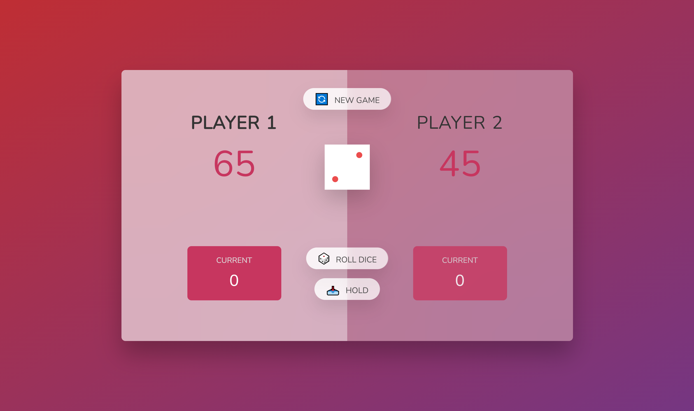

# Pig Game - A Dice Game

The **Pig Game** is a simple, fun dice game where two players take turns rolling dice to accumulate points. If a player rolls a 1, their turn ends and they lose the points accumulated during that turn. The first player to reach 100 points wins the game. This project is built using **HTML**, **CSS**, and **JavaScript**.

## Live Demo

You can play the **Pig Game** live here:  
[Play the Pig Game](https://your-username.github.io/your-repository-name/)

## Features

- **Two-player gameplay**: Alternates turns between two players.
- **Roll the dice**: Players can roll the dice to accumulate points for their turn.
- **Hold the points**: Players can hold their points to lock them in and pass the turn to the other player.
- **Lose points on 1**: If a player rolls a 1, they lose all points for the turn.
- **Responsive UI**: Works seamlessly on both desktop and mobile devices.
- **Game reset**: Option to start a new game once a winner is declared.

## Technologies Used

- **HTML**: Provides the structure of the game interface.
- **CSS**: Styles the game and makes it visually appealing.
- **JavaScript**: Handles the game logic, player actions, dice rolls, and score calculations.

## How to Play

1. **Roll the Dice**: Click the "Roll Dice" button to roll the dice. Points will accumulate for the current player, but if you roll a 1, you lose all points for the turn.
2. **Hold Your Points**: If you're happy with your current score for the turn, click the "Hold" button to add the points to your overall score and pass the turn to the other player.
3. **Winning the Game**: The game ends when one player reaches or exceeds 100 points. The winner will be displayed on the screen.

## Game Features

- **Dynamic Dice Roll**: The dice is represented as a visual element that updates each time the player rolls.
- **Score Display**: Both players' current scores are visible throughout the game.
- **Interactive UI**: Players can click to roll or hold, and the game updates in real-time.
- **Game Reset**: After one player wins, the game can be restarted with a fresh score.
